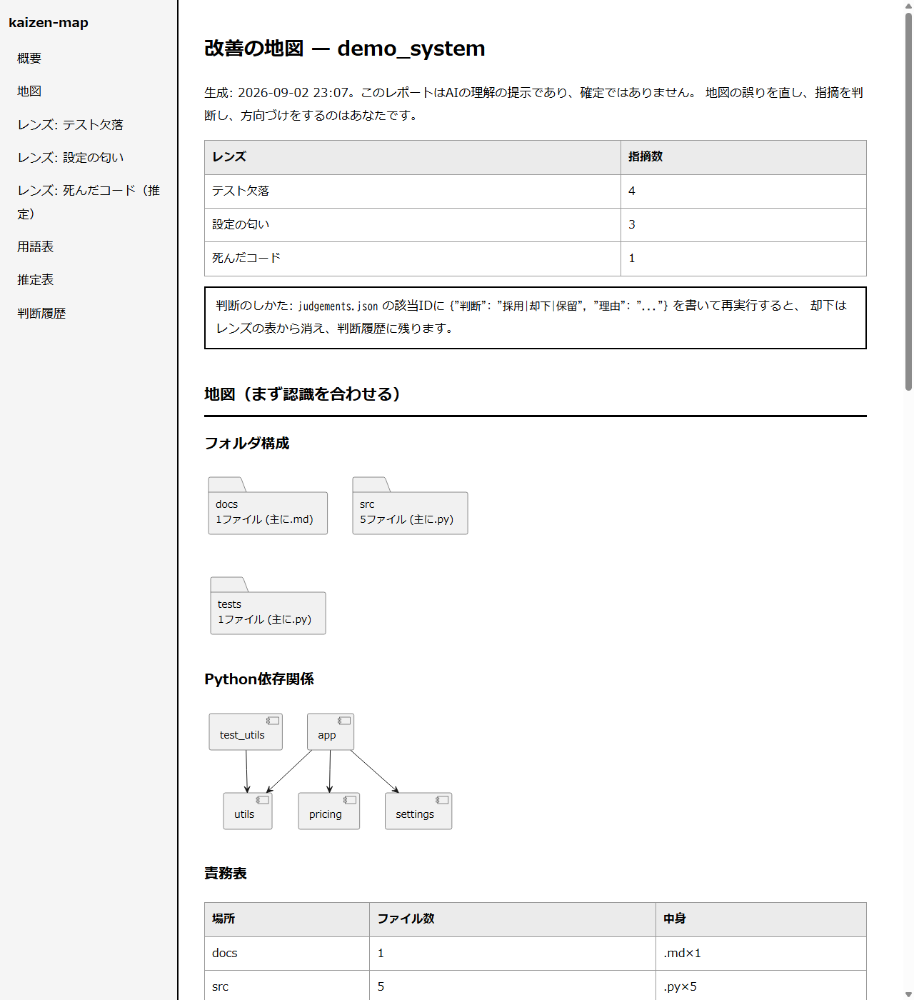
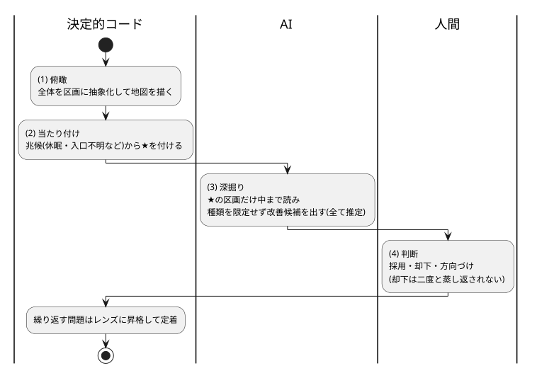

# kaizen-map — システムの地図と改善候補を、人間が判断できる1枚のHTMLに

**kaizen-map** は、対象システム（任意のフォルダ／リポジトリ）を走査して、
**地図（構成・依存のPlantUML図）＋改善候補（レンズ別の指摘）＋乖離対策の3表**を
左メニュー付きの1枚のHTMLレポートにする道具です。

Scan any codebase and render a single left-nav HTML report: a PlantUML map of the
system, findings from independent improvement lenses, and three tables that keep
the human and the AI aligned (glossary, unconfirmed estimates, judgement history).
Standard library only. The rest of this README is in Japanese.

## レポートの実物（スクリーンショット）



## しくみ（図解）



## なぜ作ったか — 改善は「理解の乖離」で失敗する

システムを知らないまま出された改善提案は的外れになり、
知っているつもりの提案は誤解を含みます。改善の前に必要なのは**共有の地図**です。

改善は必要な理解の深さで3層に分かれます。

| 層 | 種類 | このツールの扱い |
|---|---|---|
| 1 形式の層 | 一般規則に照らすだけで見つかる（テスト欠落・設定の欠落・秘密の直書き…） | **レンズで自動検出**（中身の理解が不要） |
| 2 意味の層 | 中身を読んで初めて見つかる | まず**地図**で認識を合わせてから（将来のレンズ） |
| 3 価値の層 | 人間の判断そのもの | 自動化しない。**判断欄**として人間に返す |

## 人間とAIの乖離を構造で防ぐ3つの表

| 乖離 | 対策（レポートに常設） |
|---|---|
| 語彙の違い | **用語表**：レポートが使う専門語は全て定義。未定義語は eval で赤 |
| 理解の乖離 | **推定表**：AIが確認できていない指摘（例：死んだコード候補）は本文と分離し、承認されるまで確定扱いしない |
| 学習の差 | **判断履歴**：採用・却下と理由を `judgements.json` に記録。次回の実行が必ず読み、**却下済みは蒸し返さない** |

## 使い方

```
python kaizen_map.py <対象フォルダ> [-o 出力フォルダ]            # リポジトリ1個の精査（v1）
python kaizen_map.py <対象フォルダ> -o <出力> --survey          # 全体俯瞰（v2・ワークスペース丸ごと）
```

## 発見の4工程（--survey・抽象→具体）

| 工程 | 何をするか | 誰が |
|---|---|---|
| ① 俯瞰 | 全体を区画（最上位フォルダ）に抽象化し、全体地図を描く | 決定的コード |
| ② 当たり付け | 区画ごとの兆候（休眠・入口不明・ごみ名・重複名）から「気になる区画」に★ | 決定的コード |
| ③ 深掘り | **★の区画だけ**AIが中まで読み、種類を限定せず改善候補を出す（`.claude/agents/kaizen-discovery.md` の手順で `findings-<区画名>.json` を出力→再実行で合流） | AI |
| ④ 判断 | 採用・却下・「次はこの区画」の方向づけ | 人間 |

全体を読むのは①②の粗い層だけなので、巨大なワークスペースでもトークンが破綻しません。
実測での調整：規約による意図的な同名フォルダ（連番プレフィックス等）は重複疑いから除外
（実ワークスペース45区画で★43→25に改善）。

- 出力：`kaizen-report/index.html`（左メニュー・白地黒文字・PlantUML図をSVG描画）と `judgements.json`
- 判断のしかた：`judgements.json` の該当IDに `{"判断": "採用|却下|保留", "理由": "..."}` を書いて再実行
- 図はマークダウン＋Mermaidではなく **HTML＋PlantUML**。描画は3択（既定は**外部送信ゼロ**）:
  - `PLANTUML_JAR=<plantuml.jarのパス>` … ローカルでSVG化（推奨）
  - `PLANTUML_REMOTE=1` … 公式サーバでSVG化（図の内容が外部へ送られる。明示オプトイン）
  - 指定なし … 図はソース表示（機能はすべて動く）

## いまのレンズ（第1層・すべて決定的判定）

| レンズ | 見つけるもの |
|---|---|
| テスト欠落 | 対応するテストファイルが無いソースファイル |
| 設定の匂い | CI未設定／.gitignore無し／秘密情報らしき直書き |
| 死んだコード | どこからも参照されないファイル（**常に推定扱い**。参照解析は完全ではないため） |

## eval（機械判定17項目）

```
python eval/test_kaizen_map.py
```

同梱の架空見本（問題を仕込んだ `samples/demo_system` と正常な `samples/clean_system`）で、
仕込んだ問題の全検出／正常系に赤を付けない／8章とメニューの対応／未定義語0／
確実な指摘に推定マークを付けない／**却下済みを蒸し返さない**、まで検証します。
俯瞰モードも架空の見本ワークスペース（samples/demo_workspace）で、4種の兆候の検出・正常区画に★を付けない・深掘り指摘の合流と却下の抑止・発見レンズの検出力オラクルまで検証します。ネットワーク不使用・実環境に触れません。

## 関連（同じ思想のリポジトリ）

| リポジトリ | 関係 |
|---|---|
| [fractal-spec-agent](https://github.com/hatohato-lab/fractal-spec-agent) | 「構造は機械検査できる」の先行実証。用語の定義義務・推定の隔離はここから輸入 |
| [harness-lens-reviewer](https://github.com/hatohato-lab/harness-lens-reviewer) | レンズ方式の査読と、その検出力のメタ評価 |
| [rule-retirement-eval](https://github.com/hatohato-lab/rule-retirement-eval) | 「採用されない提案は退役させる」という判断履歴の思想の源流 |

## 制限

- レンズは第1層（形式検査）のみ。意味の層（命名と実態のズレ等）は地図で認識を合わせた後の将来課題
- 死んだコード検出は文字列参照の単純な突き合わせで、動的参照は見えない（だから推定扱いにしている）
- テスト対応は `test_<名前>` / `<名前>_test` の命名規約前提

## 関連ツール（Claude Code 運用ファミリー）

同じ思想（機械判定の eval 同梱・フェイルオープン・判断は人間に返す）で作った道具の家族です。

| ツール | 役割 |
|---|---|
| [claude-code-hikitsugi](https://github.com/hatohato-lab/claude-code-hikitsugi) | チャット乗り換え時の引き継ぎ（過去→未来） |
| [claude-code-rules-sync](https://github.com/hatohato-lab/claude-code-rules-sync) | ルール変更の全チャット通知（放送） |
| [claude-code-kokuban](https://github.com/hatohato-lab/claude-code-kokuban) | チャット間の黒板（双方向の連絡） |
| [claude-code-context-meter](https://github.com/hatohato-lab/claude-code-context-meter) | 各チャットの容量の見える化（乗り換えどきの判断材料） |
| [claude-code-version-guard](https://github.com/hatohato-lab/claude-code-version-guard) | Claude Code 本体のバージョンの遅れの見張り |
| **kaizen-map**（本リポジトリ） | システムの地図と改善候補を1枚のHTMLに |

## ライセンス

MIT
